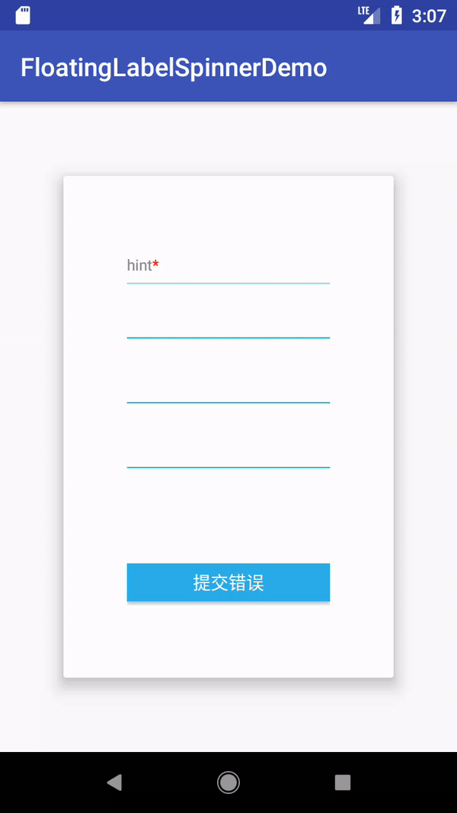
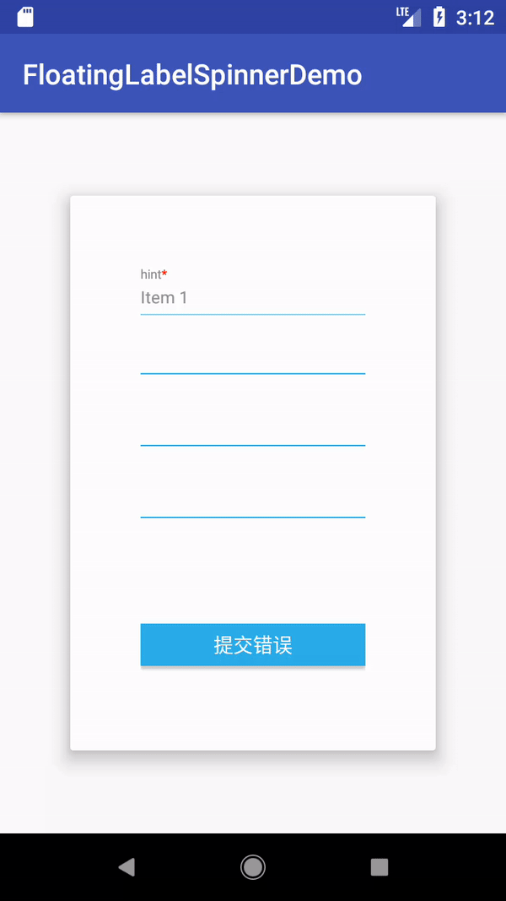

# Android浮动字体下拉框-FloatingLabelSpinner

[](https://www.apache.org/licenses/LICENSE-2.0)
[](https://jitpack.io/#james602152002/FloatingLabelSpinner)
[](https://android-arsenal.com/api?level=14)
[](http://www.methodscount.com/?lib=com.github.james602152002%3AFloatingLabelSpinner%3A1.0.1)

## [English](README_EN.md) | 中文

多数的浮动下拉框控件碍于多数的适配方式必须由xml实现，故无法在页面上显示流体布局浮动提示文字。设计上通常欠缺考虑，无法设置ForegroundColorSpan文字以满足个人需求，故开发此控件。

## 特点功能:

 - 支持代码更改字体大小(包含浮动文字、提示文字、错误文字)
 - 支持代码设置提示、分割线以及错误状态下的颜色 
 - 支持自定义弹出框dropDownHintView(弹出框头部)
 - 错误文字的字数太多会以跑马灯动画展示

## 项目演示

|浮动效果|错误效果|
|:---:|:---:|
|||

## 依赖:
```
com.github.james602152002:FloatingLabelSpinner:1.0.1
```

License
-------

    Copyright 2017 james602152002

    Licensed under the Apache License, Version 2.0 (the "License");
    you may not use this file except in compliance with the License.
    You may obtain a copy of the License at

       http://www.apache.org/licenses/LICENSE-2.0

    Unless required by applicable law or agreed to in writing, software
    distributed under the License is distributed on an "AS IS" BASIS,
    WITHOUT WARRANTIES OR CONDITIONS OF ANY KIND, either express or implied.
    See the License for the specific language governing permissions and
    limitations under the License.
