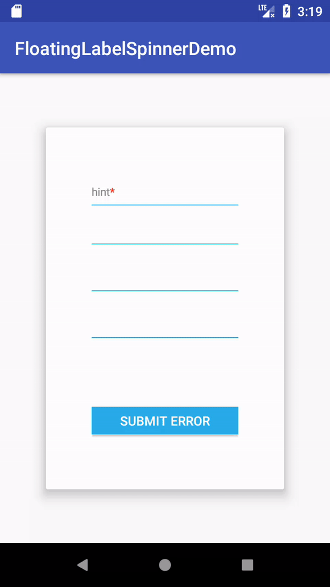

# Android-FloatingLabelSpinner

[](https://android-arsenal.com/details/1/6635)
[](https://www.apache.org/licenses/LICENSE-2.0)
[](https://android-arsenal.com/api?level=14)
[](https://jitpack.io/#james602152002/FloatingLabelSpinner)
[](https://travis-ci.org/james602152002/FloatingLabelSpinner)
[](https://codecov.io/gh/james602152002/FloatingLabelSpinner)

## English | [中文](https://github.com/james602152002/FloatingLabelSpinner)

Most of floating label spinner always use xml to adjust your widget's size. Sometimes we wanna do it by code, and we want to style our floating label by ForegroundColorSpan. My widget will satisfy your demands.

## Feature:

 - Set text size by code. (Include floating label, hint text, and error text)
 - Set hint color, divider color and error color by code.
 - Customize DropDownHintView.
 - Scrolling text animation when your error character is too long.
 - Ellipsize when hint character is too long.
 - Label support ForegroundColorSpan now.
 
## APK Demo
 - [Download APK-Demo](art/demo.apk)
 - [Sample Code Reference](https://github.com/james602152002/FloatingLabelSpinnerDemo)

## Demonstration

|Floating Status|Error Status|
|:---:|:---:|
|||

[More Demonstration](common_md/DEMONSTRATION_EN.md)

## Dependency:

```
allprojects {
	repositories {
		...
		maven { url 'https://jitpack.io' }
	}
}
```

```
dependencies {
	implementation 'com.github.james602152002:FloatingLabelSpinner:1.3.9-Beta'
}
```

## Property

```xml
<com.james602152002.floatinglabelspinner.FloatingLabelSpinner
          //floating label and hint text color
          app:j_fls_textColorHint="@android:color/holo_orange_light" 
          //divider color
          app:j_fls_colorHighlight="#0000FF" 
          //error color
          app:j_fls_colorError="#0000FF"
          //floating label text
          app:j_fls_hint="label"
          //thickness of divider
          app:j_fls_thickness="2dp"
          //horizontal margin of label
          app:j_fls_label_horizontal_margin="2dp"
          //vertical margin of label
          app:j_fls_label_vertical_margin="2dp"
          //horizontal margin of error text
          app:j_fls_error_horizontal_margin="2dp"
          //vertical margin of error text
          app:j_fls_error_vertical_margin="2dp"
          //floating label text size
          app:j_fls_label_textSize="14sp"
          //hint text size
          app:j_fls_hint_textSize="20sp"
          //error text size
          app:j_fls_error_textSize="14sp"
          //header of drop down hint view
          app:j_fls_dropDownHintView="@layout/header"
          //float animation duration(unit：ms)
          app:j_fls_float_anim_duration="800"
          //scrolling text animation duration(unit：ms)
          app:j_fls_error_anim_duration="8000"
          //open recursive mode(false to close)
          app:j_fls_recursive="true"/>
          
```

## Method

```java

	//floating label text size
	setLabel_text_size(float label_text_size);
	//hint text size
	setHint_text_size(float hint_text_size);
	//error text size
	setError_text_size(float error_text_size);
	//thichness of divider
	setThickness(int thickness);
	//divider color
	setHighlight_color(int color);
	//hint text color
	setHint_text_color(int color);
	//error color
	setError_color(int color);
	//set error text horizontal and vertical margin
	setErrorMargin(int horizontal_margin, int vertical_margin);
	//set float label text and hint text(Support ForegroundColorSpan)
	spinner.setHint(CharSequence hint);
	//set drop down hint view header
	spinner.setDropDownHintView(View view);
	//set error text(null for cancel error status)
	setError(String error);
	//set float animation duration(unit：ms)
    	setAnimDuration(short duration)
    	//set scrolling text animation duration(unit：ms)
    	setErrorAnimDuration(short duration)
    	//set recursive mode, if you have many level data to fetch , you can set it true.
        setRecursive_mode(boolean recursive_mode)
        //dismiss dialog while recursive mode
        dismiss()
        //notify datasetchanged while recursive mode
        notifyDataSetChanged()

```

## Proguard

You don't need use proguard at all.

## Donate

If you like this widget,  you could praise me some protein powder below lol

|WeChat|AliPay|
|:---:|:---:|
|||

## Suggestion

```
You must set your adapter and hint label first to use this widget.
```

```
This widget measure precisely after set adapter. If your data request from internet, I suggest:

1. Setting adapter after fetching data.
2. Customizing your UI like facebook loading style, and then refresh your UI to improve your UX.

```

License
-------

    Copyright 2017 james602152002

    Licensed under the Apache License, Version 2.0 (the "License");
    you may not use this file except in compliance with the License.
    You may obtain a copy of the License at

       http://www.apache.org/licenses/LICENSE-2.0

    Unless required by applicable law or agreed to in writing, software
    distributed under the License is distributed on an "AS IS" BASIS,
    WITHOUT WARRANTIES OR CONDITIONS OF ANY KIND, either express or implied.
    See the License for the specific language governing permissions and
    limitations under the License.
